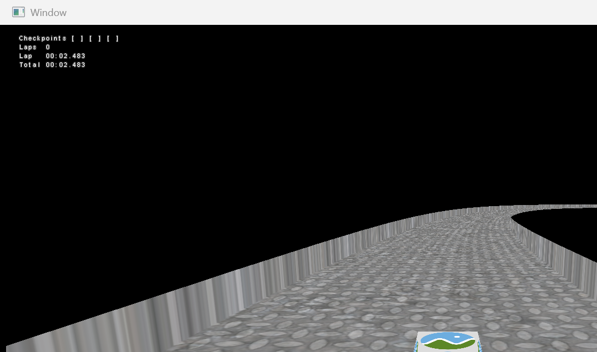
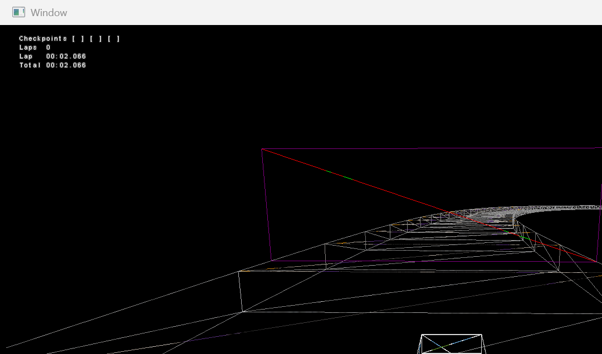

# TungstenMonoxide legacy rendering baseline

This captures Milestone 0 of `TUNGSTEN_MONOXIDE_PBR_MIGRATION_PLAN.md`. The observations below were made from Release commit `609cdc2` on the migration branch, at the Launcher's configured 1600x900 window size. No PBR package or runtime behavior is present yet.

## Visual reference

### Normal start-grid view



This frame records the legacy appearance of the textured road, both rails, the black clear/background colour, the ship's logo texture, and the non-tone-mapped HUD.

### Trigger, wireframe, and physics-ghost diagnostics



This frame was captured at the same start location with **Show Triggers**, **Wireframe**, and **Show Physics Ghost** enabled. It records:

- the magenta trigger perimeter and its red/green diagnostic diagonals;
- the road, shell, rails, and ship triangle wireframes;
- the wireframe-only physics ghost (initially coincident with the player ship);
- the HUD remaining a solid post-scene overlay.

The normal frame also records the default visible rail treatment. To reproduce the diagnostic frame manually, run `Launcher.exe TungstenMonoxide.cfg`, press F1, and enable the three controls above. Move or launch the ship before capturing if a visibly separated physics ghost is desired.

These images are comparison references, not pixel-golden tests: time text, camera smoothing, and the ghost position vary by frame.

## Active playable model baseline

### `NewTrack.mppmodel`

SHA-256: `5dcaec4350aade1628c72fedd2f7645e875aab359c6cf0d5b5e3476468d6036b`

All meshes are non-indexed triangle lists. Every vertex stream uses the same 36-byte layout:

```text
position3 float32       12 bytes
normal3   float32       12 bytes
texcoord2 float32        8 bytes
colour4   unorm8         4 bytes
                              --
total                    36 bytes
```

| Mesh | Material key | Triangles | Vertices | Indexed |
| --- | --- | ---: | ---: | --- |
| `path-0-surface` | `Tracks/TrackAsphaltMaterial` | 1,490 | 4,470 | no |
| `path-0-shell` | `Tracks/DefaultShellMaterial` | 4,470 | 13,410 | no |
| `path-0-rail-left` | `Tracks/DefaultRailMaterial` | 3,418 | 10,254 | no |
| `path-0-rail-right` | `Tracks/DefaultRailMaterial` | 3,418 | 10,254 | no |
| `trigger-starter-finish` | `Tracks/DefaultTriggerMaterial` | 2 | 6 | no |
| `trigger-starter-cp1` | `Tracks/DefaultTriggerMaterial` | 2 | 6 | no |
| `trigger-starter-cp2` | `Tracks/DefaultTriggerMaterial` | 2 | 6 | no |
| `trigger-starter-cp3` | `Tracks/DefaultTriggerMaterial` | 2 | 6 | no |

The maximum vertex count in one active track mesh is **13,410** (`path-0-shell`). The file has four unique material keys. `Tracks/NewTrack` in `Resources.xml` currently maps all four through `DependentResource` IDs with exactly matching strings.

### `box.mppmodel`

SHA-256: `939cb66b285629550a5c0be080aa5c2dba4e07b5bd3a095599f2a84bce008b1d`

| Mesh | Embedded material key | Triangles | Vertices | Index count/width | Vertex stride |
| --- | --- | ---: | ---: | --- | ---: |
| `Mesh` | `BoxTextured/Texture` | 12 | 24 | 36 / 16-bit | 36 bytes |

This file serves both as the ship source and the bundled physical mesh-object model. The Play state deliberately replaces the ship's embedded `BoxTextured/Texture` key with the game resource's legacy `Texture` material while rebuilding the model. A placed mesh object instead resolves its embedded key through the owning track's dependent-resource map. The current `Tracks/NewTrack` declaration has no `BoxTextured/Texture` dependent ID, so Map records a warning and skips that placement's render sub-mesh; its `Type=Physical` collision geometry is still built. `ModelTool.DefaultFallbackMaterial3D` is a separate mapping for models exported with Model Tool's unassigned-material key.

The active ship mesh is indexed, unlike all active track meshes. Its maximum vertex count is **24**.

## Other bundled model files

These files are not selected by the current `Tracks/NewTrack` game flow, but are recorded so later asset cleanup does not mistake a pre-existing layout/material difference for a PBR conversion regression. All vertex streams are the same 36-byte layout described above.

| File | Indexed | Mesh count | Unique material keys | Maximum vertices in one mesh |
| --- | --- | ---: | --- | ---: |
| `model.mppmodel` | yes, 16-bit | 1 | `BoxTextured/Texture` | 24 |
| `New_Track.mppmodel` | no | 8 | `Tracks/TrackAsphaltMaterial`, `Tracks/DefaultShellMaterial`, `Tracks/DefaultRailMaterial`, `Tracks/DefaultTriggerMaterial` | 8,730 |
| `NewTrack2.mppmodel` | no | 8 | `Tracks/AsphaltTrack`, `Tracks/DefaultShellMaterial`, `Tracks/DefaultRailMaterial`, `Tracks/DefaultTriggerMaterial` | 7,998 |
| `NewTrack3.mppmodel` | no | 8 | `Tracks/TrackAsphaltMaterial`, `Tracks/DefaultShellMaterial`, `Tracks/DefaultRailMaterial`, `Tracks/DefaultTriggerMaterial` | 7,998 |

`NewTrack2.mppmodel` is the only bundled track model whose road mesh embeds the `TrackMaterial` wrapper key (`Tracks/AsphaltTrack`) rather than the concrete legacy material key. This difference must remain covered by staged coexistence if that model becomes active before legacy cleanup.

## Automated baseline guard

CTest `tungsten_monoxide_legacy_pbr_baseline` reads the real bundled `NewTrack.mppmodel` MeshMetadata section and `Resources.xml`. For every unique embedded material key it verifies:

1. `Tracks/NewTrack` has a `DependentResource` whose `id` exactly equals the key;
2. the reference resolves to a declared resource;
3. during this legacy milestone, the target type is `Material` or `TrackMaterial`.

The test intentionally does not instantiate `RenderSystem`, load GPU resources, or modify the application. Milestone 3 will update its accepted target type when mappings move to `PbrMaterialBinding`.

## Milestone 0 validation

- Release configuration and Launcher build: passed.
- `tungsten_monoxide_legacy_pbr_baseline`: passed.
- Full committed CTest suite: see the implementation commit's validation record.
- Runtime behavior: unchanged; all temporary debug defaults used while capturing the second image were reverted before the validation build.
